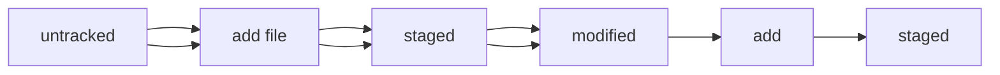

# Git

## Инициализация локального репозитория:
* Первым делом нужно создать рабочую директорию для проекта
`mkdir ~/git`
* Следующим шагом будет создание локального репозитория
для этого переёдем в папку с репозиторием 
`cd ~/git`
и введем следующую команду
`git init`
Готово репозиторий создан и именем 'master' или 'main'

----

## Удалить репозирий:
Для того чтобы удалить репозиторий нужно просто удалить папку ~/git/.git со всем ее содержимым

## Узнать статус локальног орепозитория:
`git status`

## Сохранить файлы в репозитории:
`git add filename`
или 
`git add -all`

## Commit
для того что бы создать коммит делаем:
`git commit -m 'firs commit'`

##  Просмотр истории изменений
`git log`

----

## Связываем локальный и удаленный репозиторий
first (имя удалённого репозитория)
https://github.com/Asstet3/git-readme.git (ссылка на удаленный репозиторий)
`git remote add first https://github.com/Asstet3/git-readme.git`

## сделать коммит в удаленный репозиторий:
первый раз нужно выполнить с параметром -u(свяжет локальную ветку с удаленной веткой), дальше можно делать 'push' без параметров
`git push  -u firs master`

----
## Hash
Хэш это строка состоящая из цифр и букв, небольшой длинны(например SHA1  40 символов)
В гит хэш коммита служит как идентификатор коммита, его можно передавать как параметр  командам, что бы указать с каким коммитом нужно произвести  то или иное действие.
Все хэши и таблица сохраняются в папке .git репозитория.
командой:
`git log`
можно увидеть не только описание коммита, но и хэш коммита, автоа и дату.
Сокращенный лог вызывается командой:
 `git log --oneline`
Команда сокращает вывод каждого коммита до одной строки.
Хэш сокращает до минимальной длинны позволяющей его уникально идентифицировать.

## HEAD
Файл HEAD  один из служебных файлов в папке .git. Он указывает на коммит, который сделан последним.
просмотро HEAD
```
cat ~/git/.git/HEAD
ref: refs/heads/master # в файле вот такая ссылка
в файле refs/heads/master  #будет лежать хэш последнего коммита 
```
Когда вы делаете коммит, то соответсвенно обновляется и HEAD

## Статусы в git 
untracked - файл не отслеживается
tracked - файл отслеживается,  но не менялся
staged - файл подготовлен к push #git add file
modified - файл был подготовлен к push  и после этого был модифицирован, для коммита требуется заново добавить файл в git, иначе загрузится  предыдущая версия модификации
##Добавим схему изучения текущего урока

## Гит статус
Тут можно посмотреть состояние файлов, которые(untracked,tracked,staged,modified)

## Как писать коммиты
длина сообщения от 30 до 72 символов;
первое слово — глагол в инфинитиве («исправить», «дополнить», «добавить» и другие);
и так далее.
